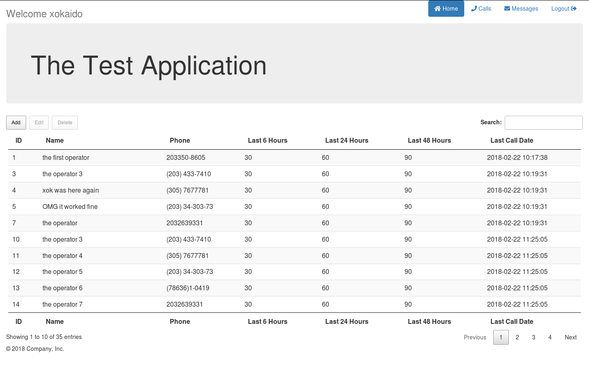

# Test Application In Pure PHP

This was a test application for a job interview.
The task involved writing a pure php app without
using a single library. The app should handle user
auth + CRUD on phonebooks, calls and messages.
The phonebook part is done, it's possible to add / edit / delete
records but the rest is not implemented.

